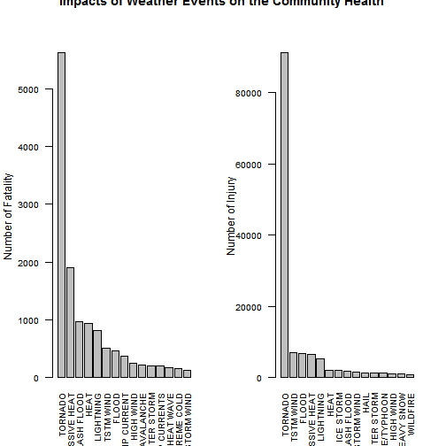
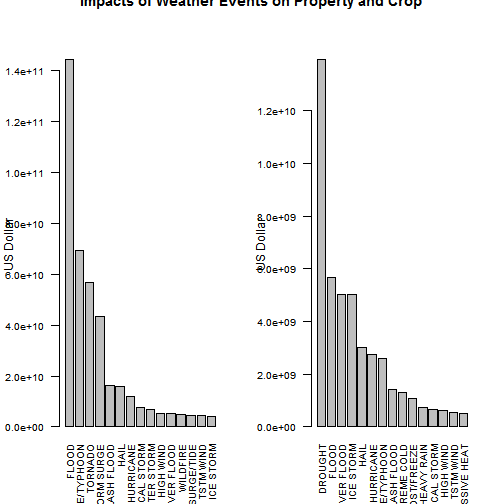
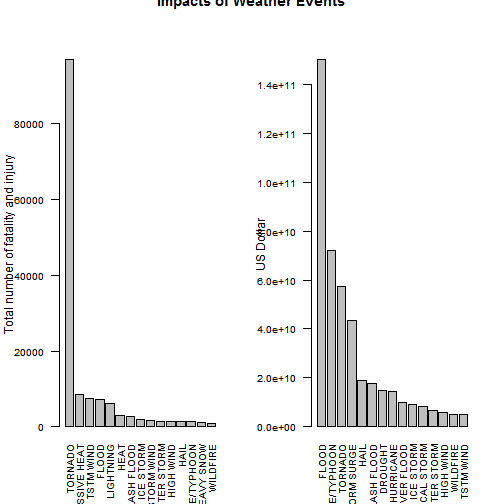

# Storms and other severe weather events analysis
Reproducible Research - Peer Assessment Assignment 2

## Synopsis

Severe weather has a large impact on health and economics, making it very important to study the value of damage and which type of severe weather has the highest impact. This report aims to explore these issues. The below analysis shows that tornado and flood is the two weather events that cause highest health and economics damage, respectively. 

## Data Processing

The data used in this report are obtained from NOAA Storm Database.


```r
destname <- 'repdata-data-StormData.csv.bz2'
URL <- 'https://d396qusza40orc.cloudfront.net/repdata%2Fdata%2FStormData.csv.bz2'
download.file(URL, destname, mode = 'wb')
download_time <- Sys.time()
download_time
```

```
## [1] "2014-07-27 15:09:03 CDT"
```

Because of the extensiveness of the original storm data, we will load only necessary data for the analysis, including event type, the number of fatality and injury, and the value of property and crop damage.  


```r
data <- read.csv('repdata-data-StormData.csv.bz2', colClasses = (c(rep('NULL', 7), 
                NA, rep('NULL', 14), NA, NA, NA, NA, NA, NA,  rep('NULL', 9))), 
                header = TRUE, as.is = TRUE)

data$PROPDMGEXP <- toupper(data$PROPDMGEXP)
data$CROPDMGEXP <- toupper(data$CROPDMGEXP)

data$EVTYPE <- factor(data$EVTYPE, levels = unique(data$EVTYPE))
data$PROPDMGEXP <- factor(data$PROPDMGEXP, levels = unique(data$PROPDMGEXP))
data$CROPDMGEXP <- factor(data$CROPDMGEXP, levels = unique(data$CROPDMGEXP))
```

The value of property and crop damage are calculated as below.


```r
# Create a dataframe and convert "H", "K", "M", and "B" into hundred, thousand, million, and billion, respectively. 

damage_value <- data.frame(unit=sort(levels(data$PROPDMGEXP)), value=c(rep(1,13), 1e+09, 1e+02, 1e+03, 1e+06))

for(i in damage_value$unit) {
    data$PropDmgUnit[data$PROPDMGEXP == i] <- damage_value$value[damage_value$unit == i]
    }
data$PropDmgValue <- data$PROPDMG * data$PropDmgUnit

for(j in damage_value$unit) {
    data$CropDmgUnit[data$CROPDMGEXP == j] <- damage_value$value[damage_value$unit == j]
    }
data$CropDmgValue <- data$CROPDMG * data$CropDmgUnit
```

Similarly, the number of fatality and injury caused by each event are also calculated.


```r
library (plyr)
evtype_sum <- ddply(data, ~EVTYPE, summarise, 
        Fatalities = sum(FATALITIES), 
        Injuries = sum(INJURIES), 
        PropDmg = sum(PropDmgValue), 
        CropDmg = sum(CropDmgValue))
evtype_sum$EconDmg <- evtype_sum$PropDmg + evtype_sum$CropDmg
evtype_sum$HealthDmg <- evtype_sum$Fatalities + evtype_sum$Injuries
```

## Results

According to the above calculation, we obtain the list of events that caused highest impact on health and economics.


```r
highest_health_impact <- head (evtype_sum[order(-evtype_sum$HealthDmg),], 15)
fatality <- head (evtype_sum[order(-evtype_sum$Fatalities),], 15)
injury <- head (evtype_sum[order(-evtype_sum$Injuries),], 15)

highest_econ_impact <- head(evtype_sum[order(-evtype_sum$EconDmg),], 15)
prop <- head (evtype_sum[order(-evtype_sum$PropDmg),], 15)
crop <- head (evtype_sum[order(-evtype_sum$CropDmg),], 15)

print(highest_health_impact)
```

```
##                EVTYPE Fatalities Injuries   PropDmg   CropDmg   EconDmg
## 1             TORNADO       5633    91346 5.694e+10 4.150e+08 5.735e+10
## 99     EXCESSIVE HEAT       1903     6525 7.754e+06 4.924e+08 5.002e+08
## 2           TSTM WIND        504     6957 4.485e+09 5.540e+08 5.039e+09
## 36              FLOOD        470     6789 1.447e+11 5.662e+09 1.503e+11
## 15          LIGHTNING        816     5230 9.287e+08 1.209e+07 9.408e+08
## 27               HEAT        937     2100 1.797e+06 4.015e+08 4.033e+08
## 20        FLASH FLOOD        978     1777 1.614e+10 1.421e+09 1.756e+10
## 65          ICE STORM         89     1975 3.945e+09 5.022e+09 8.967e+09
## 16  THUNDERSTORM WIND        133     1488 3.483e+09 4.148e+08 3.898e+09
## 8        WINTER STORM        206     1321 6.688e+09 2.694e+07 6.715e+09
## 46          HIGH WIND        248     1137 5.270e+09 6.386e+08 5.909e+09
## 3                HAIL         15     1361 1.573e+10 3.026e+09 1.876e+10
## 973 HURRICANE/TYPHOON         64     1275 6.931e+10 2.608e+09 7.191e+10
## 53         HEAVY SNOW        127     1021 9.326e+08 1.347e+08 1.067e+09
## 221          WILDFIRE         75      911 4.765e+09 2.955e+08 5.061e+09
##     HealthDmg
## 1       96979
## 99       8428
## 2        7461
## 36       7259
## 15       6046
## 27       3037
## 20       2755
## 65       2064
## 16       1621
## 8        1527
## 46       1385
## 3        1376
## 973      1339
## 53       1148
## 221       986
```

```r
print(highest_econ_impact)
```

```
##                EVTYPE Fatalities Injuries   PropDmg   CropDmg   EconDmg
## 36              FLOOD        470     6789 1.447e+11 5.662e+09 1.503e+11
## 973 HURRICANE/TYPHOON         64     1275 6.931e+10 2.608e+09 7.191e+10
## 1             TORNADO       5633    91346 5.694e+10 4.150e+08 5.735e+10
## 204       STORM SURGE         13       38 4.332e+10 5.000e+03 4.332e+10
## 3                HAIL         15     1361 1.573e+10 3.026e+09 1.876e+10
## 20        FLASH FLOOD        978     1777 1.614e+10 1.421e+09 1.756e+10
## 194           DROUGHT          0        4 1.046e+09 1.397e+10 1.502e+10
## 226         HURRICANE         61       46 1.187e+10 2.742e+09 1.461e+10
## 52        RIVER FLOOD          2        2 5.119e+09 5.029e+09 1.015e+10
## 65          ICE STORM         89     1975 3.945e+09 5.022e+09 8.967e+09
## 209    TROPICAL STORM         58      340 7.704e+09 6.783e+08 8.382e+09
## 8        WINTER STORM        206     1321 6.688e+09 2.694e+07 6.715e+09
## 46          HIGH WIND        248     1137 5.270e+09 6.386e+08 5.909e+09
## 221          WILDFIRE         75      911 4.765e+09 2.955e+08 5.061e+09
## 2           TSTM WIND        504     6957 4.485e+09 5.540e+08 5.039e+09
##     HealthDmg
## 36       7259
## 973      1339
## 1       96979
## 204        51
## 3        1376
## 20       2755
## 194         4
## 226       107
## 52          4
## 65       2064
## 209       398
## 8        1527
## 46       1385
## 221       986
## 2        7461
```

According to this result, tornado is the event that causes highest number of falality, injury and thus has the highest health impact. 

Excessive heat causes second highest number of fatality and health impact, while TSTM wind causes second highest number of injury. 

Similarly, flood causes highest damage in terms of economics.

The graphs below demonstrate the health impact of severe weather events.


```r
par(mfrow = c(1, 2))

barplot(height = fatality$Fatalities,
        names.arg = fatality$EVTYPE,
        las = 2, cex.axis = 0.8, cex.names = 0.8, 
        xlab = "",
        ylab = "Number of Fatality")
        
barplot(height = injury$Injuries,
        names.arg = injury$EVTYPE,
        las = 2, cex.axis = 0.8, cex.names = 0.8, 
        xlab = "",
        ylab = "Number of Injury")
        
title(main = "Impacts of Weather Events on the Community Health", outer = TRUE)
```

 

The graphs below demonstrate the economic impact of severe weather events.


```r
par(mfrow = c(1,2))

barplot(height = prop$PropDmg,
        names.arg = prop$EVTYPE,
        las = 2, cex.axis = 0.8, cex.names = 0.8, 
        xlab = "",
        ylab = "US Dollar")

barplot(height = crop$CropDmg,
        names.arg = crop$EVTYPE,
        las = 2, cex.axis = 0.8, cex.names = 0.8, 
        xlab = "",
        ylab = "US Dollar")
        
title(main = "Impacts of Weather Events on Property and Crop", outer = TRUE)
```

 


```r
par(mfrow = c(1,2))

barplot(height = highest_health_impact$HealthDmg,
        names.arg = highest_health_impact$EVTYPE,
        las = 2, cex.axis = 0.8, cex.names = 0.8, 
        xlab = "",
        ylab = "Total number of fatality and injury")

barplot(height = highest_econ_impact$EconDmg,
        names.arg = highest_econ_impact$EVTYPE,
        las = 2, cex.axis = 0.8, cex.names = 0.8, 
        xlab = "",
        ylab = "US Dollar")
        
title(main = "Impacts of Weather Events", outer = TRUE)
```

 

